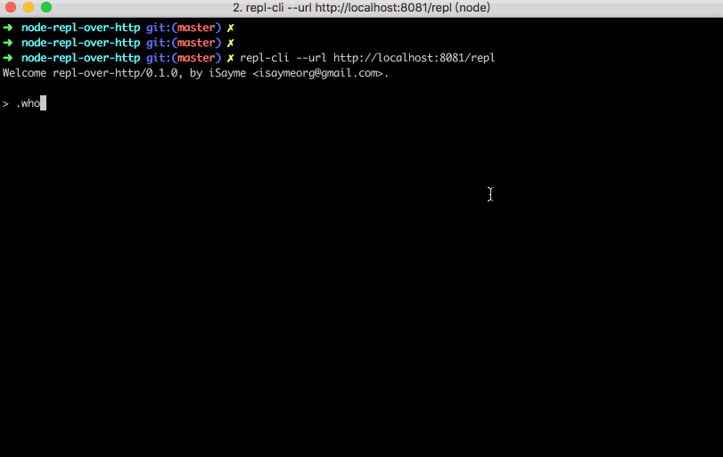
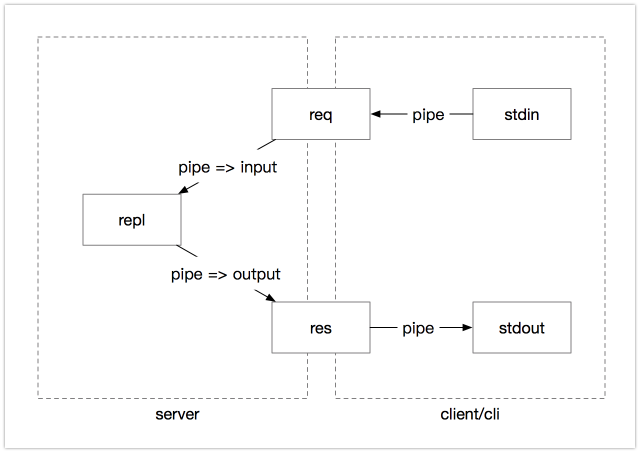

# REPL over HTTP(s)

[](https://travis-ci.org/isayme/node-repl-over-http)
[](https://coveralls.io/github/isayme/node-repl-over-http?branch=master)

A repl tool over HTTP(s)

## Use as a middleware
> npm i repl-over-http

Click [here](./example/server.js) for a full example.

```
const express = require('express')
const replOverHttp = require('repl-over-http')

const app = express()

const middleware = replOverHttp() // create a `function (req, res)` middleware

app.put('/repl', middleware)

app.listen(8081)
```

## Use as a cli
> npm i -g repl-over-http

> repl-cli --uri http://your-repl-host

### Screenshot


### note about curl
We can connect server with cmd `curl -sNT. http://localhost:8081/repl`.

But if reponse from server too large, curl will crash ~

## How it works
refer [Running a node.js REPL over `curl`](https://gist.github.com/TooTallNate/2053342)



## Security
For security reason, we only allow request from localhost by default. Custom with option `preflight`.

`node inspect -p {node pid}` will be another great alternative if you can access the server which running your node service.

